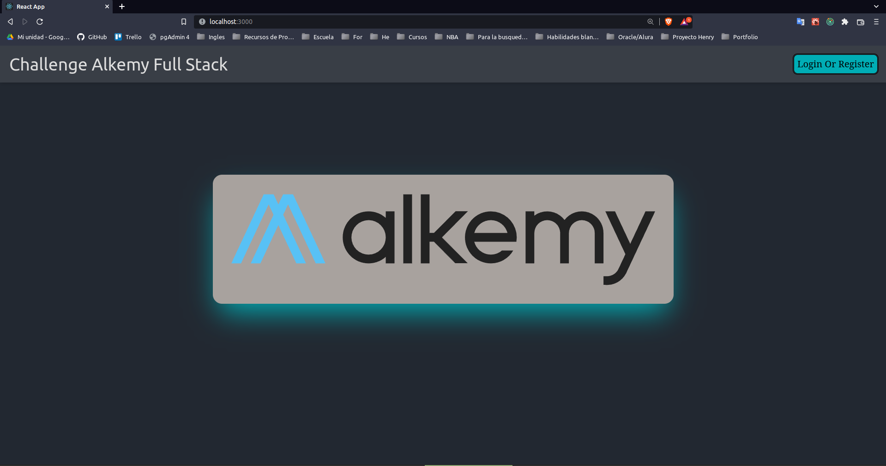
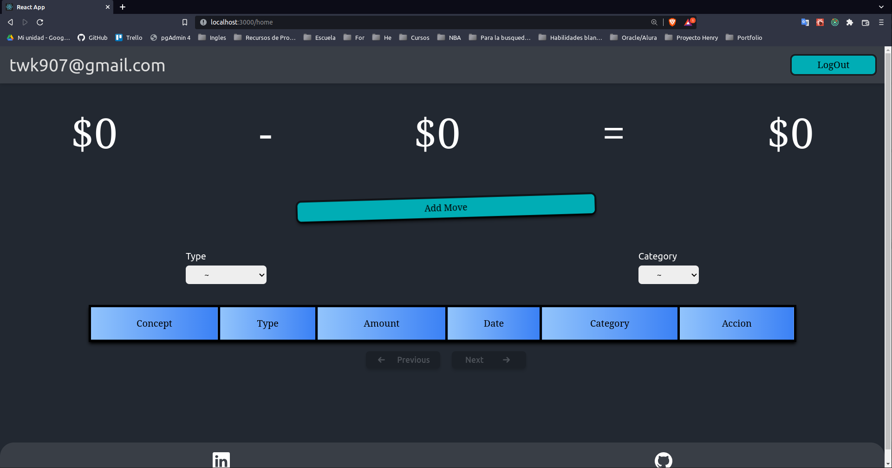
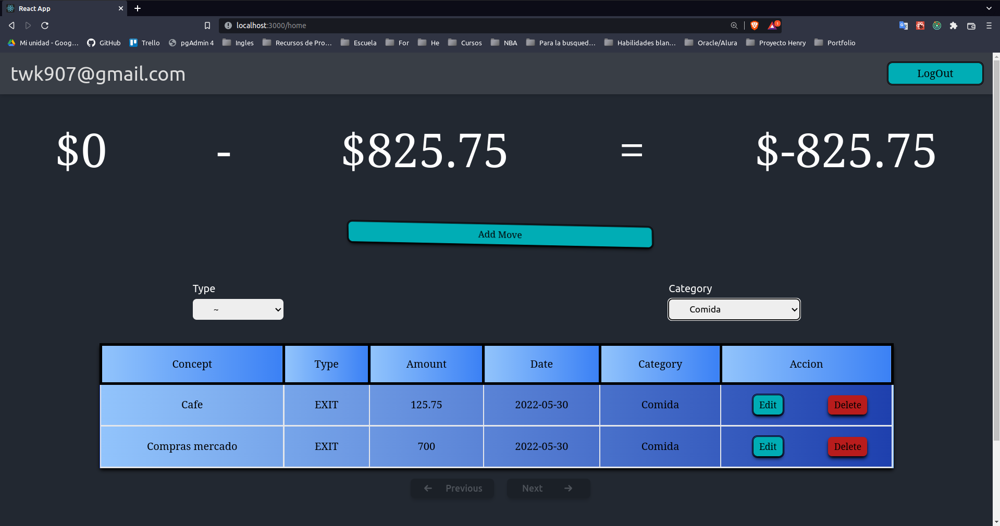
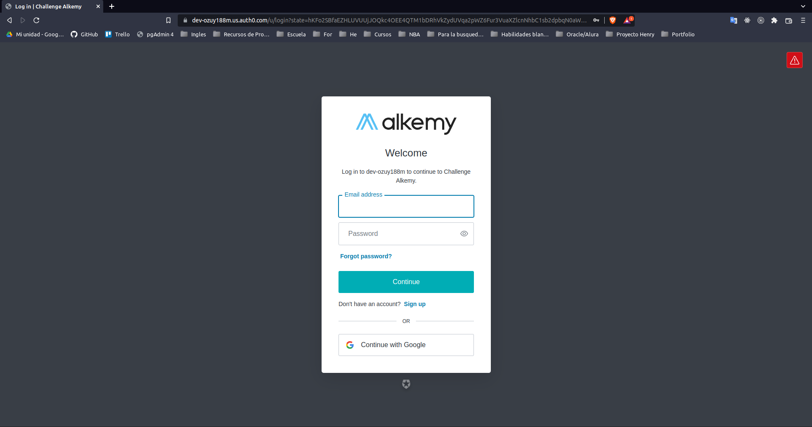
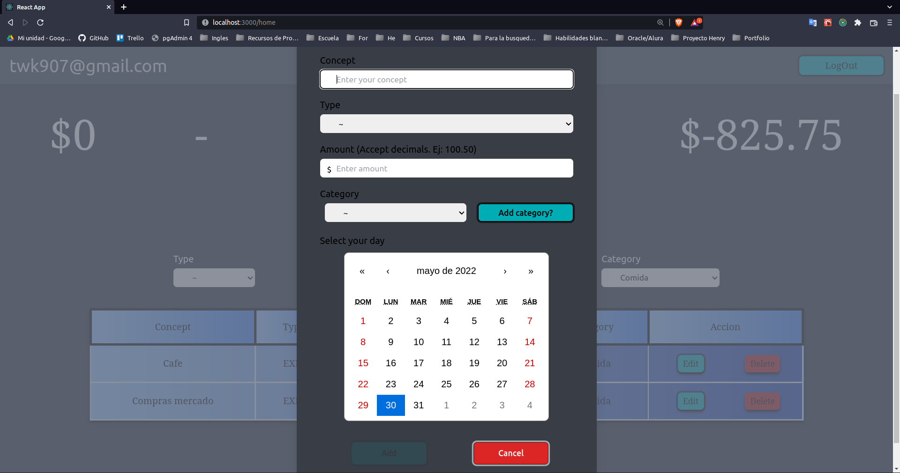
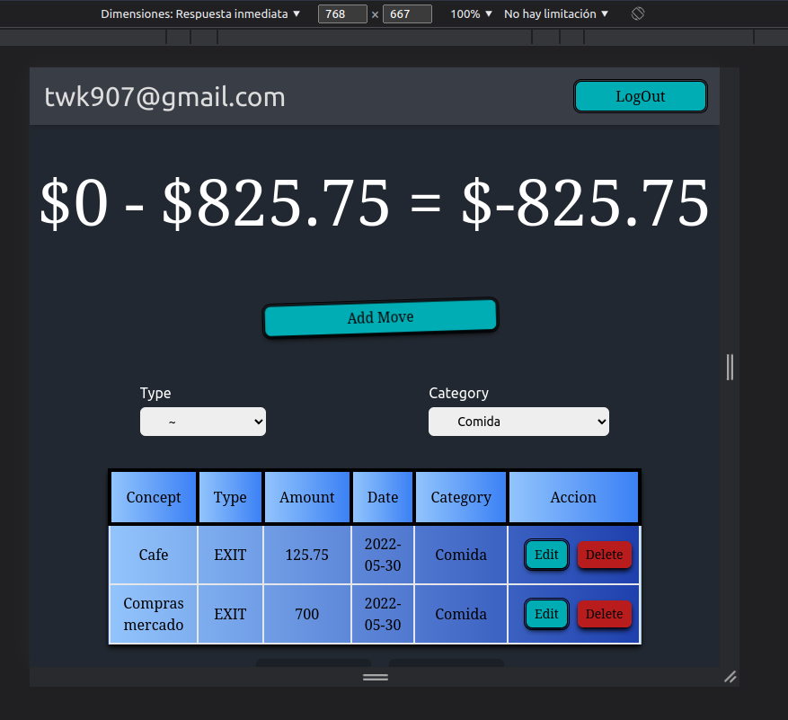
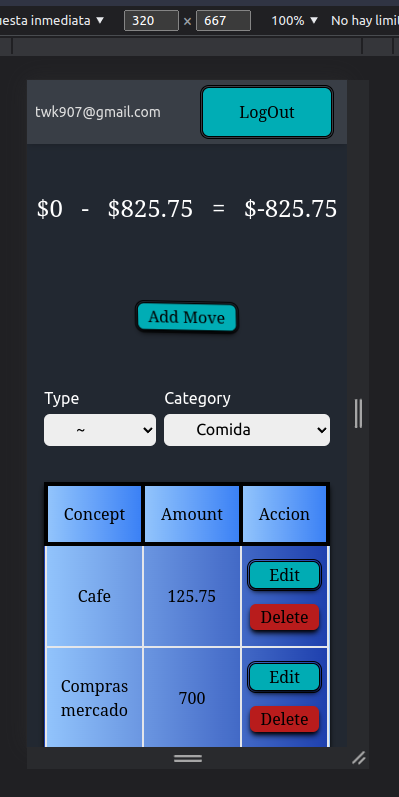

# **Challenge Full Stack Alkemy**

## objective
**Develop an application for personal budget management. The same must
allow to create and edit income and expenses of money, and show a balance resulting from the
registered operations.**

___
## Features

- Front: React, TailwindCss, TailwindUi, react-animated-css, react-calendar, redux, redux-persist, Auth0
- Back: NodeJs, ExpressJs, async/await, ECMA6
- BD: PostgreSQL
- Some buttons are animated, others only when they are mounted or unmounted. I invite you to discover them
- Add the option that each user can add their own categories
- In the requirements certain things about registration and login were requested, I decided to use Auth0 since this point was optional and it is always a good time to learn something new.
- Thanks to the back you can filter by category or type of movement

___
## How to start the project?

### First

Add the .env file to the `api/` folder along with the keys provided by, it should contain

~~~
DB_USER= 
DB_PASSWORD=
DB_HOST=
~~~

This, to be able to correctly raise the database.   
**Note**: The sql file of the database is located in the root folder. You can do it by executing the file or modifying the `api/index.js` file by modifying to `force: true`, this will create it with the respective tables but every time you restart the back all the data will be deleted
### Second

Run where appropriate npm install. In both `api/` and `client/`
~~~
npm install
~~~

### Third

Execute in the two terminals (back and front) the command

~~~
npm start
~~~

___

## Project images

<h4>Landing</h4>

<h4>Home</h4>

 

<h4>Login</h4>

 
<h4>Form</h4>

 
<h4>Tablet</h4>

 
<h4>Mobile</h4>
